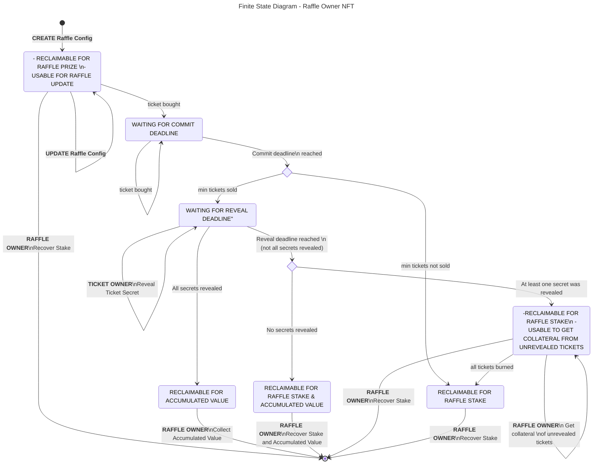

Diagram showing the state transitions of the **Raffle Owner NFT**.

```mermaid

---
 title: Finite State Diagram - Raffle Owner NFT
---
stateDiagram-v2
    PRIZEANDUPDATE: - RECLAIMABLE FOR RAFFLE PRIZE \n- USABLE FOR RAFFLE UPDATE  
    LOCKEDBYCDDL: WAITING FOR COMMIT DEADLINE
    VALUE: RECLAIMABLE FOR ACCUMULATED VALUE  
    PRIZE: RECLAIMABLE FOR RAFFLE STAKE  
    PRIZEANDCOLLATERAL: -RECLAIMABLE FOR RAFFLE STAKE\n -USABLE TO GET COLLATERAL FROM UNREVEALED TICKETS 
    PRIZEANDVALUE: RECLAIMABLE FOR RAFFLE STAKE & ACCUMULATED VALUE  
    LOCKEDBYRDDL: WAITING FOR REVEAL DEADLINE"
    state C1 <<choice>> 
    state C3 <<choice>> 

    [*] --> PRIZEANDUPDATE: <b> CREATE <b> Raffle Config 
    PRIZEANDUPDATE --> [*]: <b>RAFFLE OWNER</b>\nRecover Stake
    PRIZEANDUPDATE --> PRIZEANDUPDATE: <b> UPDATE <b> Raffle Config
    PRIZEANDUPDATE --> LOCKEDBYCDDL: ticket bought

    LOCKEDBYCDDL --> LOCKEDBYCDDL: ticket bought
    LOCKEDBYCDDL --> C1: Commit deadline\n reached
    C1 --> PRIZE: min tickets not sold
    C1 --> LOCKEDBYRDDL: min tickets sold

    LOCKEDBYRDDL --> LOCKEDBYRDDL: <b>TICKET OWNER</b>\nReveal Ticket Secret
    LOCKEDBYRDDL --> VALUE: All secrets revealed

    LOCKEDBYRDDL --> C3: Reveal deadline reached \n (not all secrets revealed)
    C3 --> PRIZEANDVALUE: No secrets revealed
    C3 --> PRIZEANDCOLLATERAL: At least one secret was revealed
    PRIZEANDCOLLATERAL --> PRIZEANDCOLLATERAL: <b>RAFFLE OWNER</b>\n Get collateral \nof unrevealed tickets  
    PRIZEANDCOLLATERAL --> PRIZE: all tickets burned

    VALUE --> [*]: <b>RAFFLE OWNER</b>\nCollect Accumulated Value
    PRIZEANDVALUE --> [*]: <b>RAFFLE OWNER</b>\nRecover Stake and Accumulated Value
    PRIZEANDCOLLATERAL --> [*]: <b>RAFFLE OWNER</b>\nRecover Stake
    PRIZE --> [*]: <b>RAFFLE OWNER</b>\nRecover Stake

```