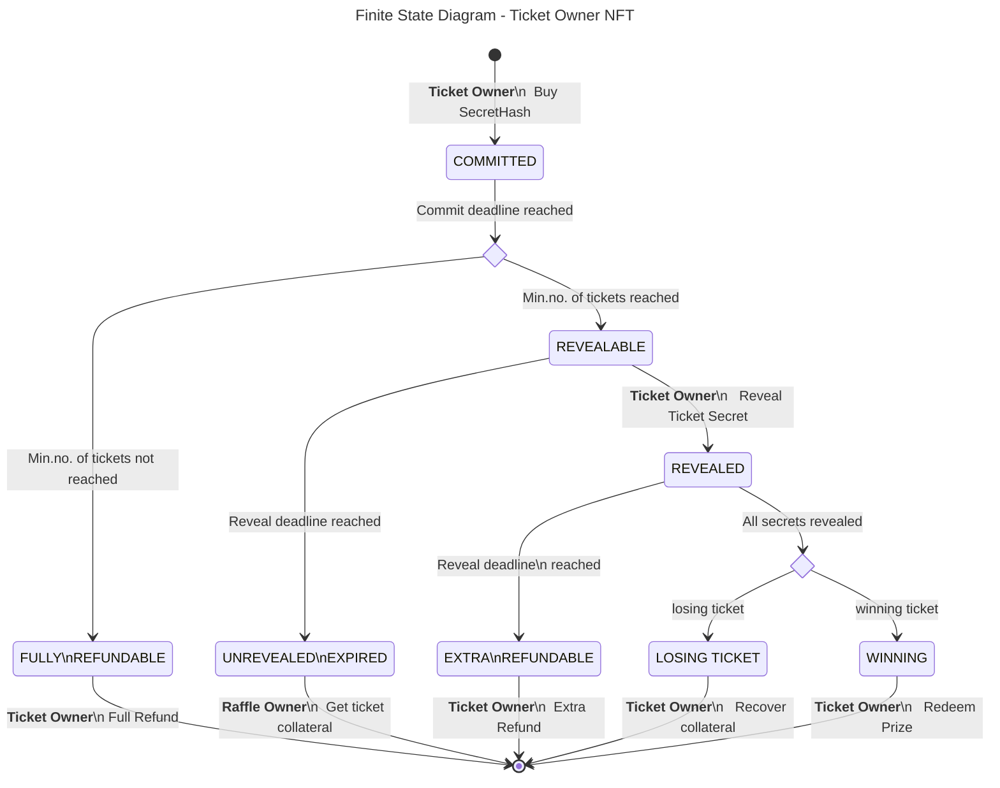

```mermaid

 ---
 title: Finite State Diagram - Ticket Owner NFT
---
stateDiagram-v2

    state C1  <<choice>>
    state C2  <<choice>>

    REFUNDABLEFULL: FULLY\nREFUNDABLE  
    UNREVEALEDEXPIRED: UNREVEALED\nEXPIRED  
    REFUNDABLEEXTRA: EXTRA\nREFUNDABLE 
    LOSING: LOSING TICKET

    [*] --> COMMITTED :<b>Ticket Owner</b>\n  Buy SecretHash
    COMMITTED --> C1 : Commit deadline reached   
    C1 --> REFUNDABLEFULL : Min.no. of tickets not reached
    REFUNDABLEFULL --> [*] : <b>Ticket Owner</b>\n  Full Refund
    C1 --> REVEALABLE : Min.no. of tickets reached
    REVEALABLE  --> UNREVEALEDEXPIRED : Reveal deadline reached  
    UNREVEALEDEXPIRED --> [*] : <b>Raffle Owner</b>\n  Get ticket collateral
    REVEALABLE --> REVEALED : <b>Ticket Owner</b>\n   Reveal Ticket Secret 
    REVEALED  --> REFUNDABLEEXTRA : Reveal deadline\n reached  
    REFUNDABLEEXTRA --> [*] : <b>Ticket Owner</b>\n  Extra Refund 
    REVEALED --> C2 : All secrets revealed
    C2 --> WINNING :  winning ticket
    C2 --> LOSING :  losing ticket
    LOSING --> [*] : <b>Ticket Owner</b>\n   Recover collateral
    WINNING --> [*]: <b>Ticket Owner</b>\n   Redeem Prize 


```
