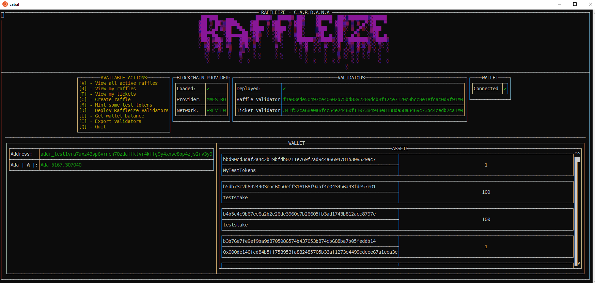

# RAFFLEIZE C-A-R-D-A-N-A  
### <br> (Commit-And-Reveal-Decentralized-Application-for-Native-Assets)
Version 2 approved
Prepared by Marius Georgescu  

This project is part of
[F10-developer-ecosystem-the-evolution - Project Catalyst Idea #105248 ](https://projectcatalyst.io/funds/10/f10-developer-ecosystem-the-evolution/development-of-a-cardano-dapp-and-extensive-documentation-of-each-step-along-the-way)

Table of Contents
=================
- [RAFFLEIZE C-A-R-D-A-N-A](#raffleize-c-a-r-d-a-n-a)
    - [ (Commit-And-Reveal-Decentralized-Application-for-Native-Assets)](#-commit-and-reveal-decentralized-application-for-native-assets)
- [Table of Contents](#table-of-contents)
  - [Revision History](#revision-history)
  - [1.Introduction](#1introduction)
    - [1.1 Purpose](#11-purpose)
    - [1.2 Intended Audience and Reading Suggestions](#12-intended-audience-and-reading-suggestions)
    - [1.3 Scope](#13-scope)
      - [Objectives and Benefits](#objectives-and-benefits)
      - [Differentiators](#differentiators)
    - [1.4 References](#14-references)
  - [2. Description](#2-description)
    - [2.1 Perspective](#21-perspective)
      - [Context and Origin](#context-and-origin)
      - [Relation to Larger Systems](#relation-to-larger-systems)
      - [System Overview and Interfaces](#system-overview-and-interfaces)
        - [User Interface Component](#user-interface-component)
        - [Wallet Component](#wallet-component)
        - [DApp Service Provider](#dapp-service-provider)
        - [Blockchain Network](#blockchain-network)
      - [High Level Architecture:](#high-level-architecture)
        - [Version 1: Centralized Hosting and Backend Transaction Handling](#version-1-centralized-hosting-and-backend-transaction-handling)
        - [Version 2: Centralized Hosting with Partial Decentralized Transaction Handling](#version-2-centralized-hosting-with-partial-decentralized-transaction-handling)
        - [Version 3: Decentralized Hosting and Transaction Handling](#version-3-decentralized-hosting-and-transaction-handling)
    - [2.2 Functionality](#22-functionality)
    - [Use-cases](#use-cases)
      - [NonAuthenticated User](#nonauthenticated-user)
      - [Authenticated User](#authenticated-user)
        - [Ticket Owner](#ticket-owner)
        - [Organizer](#organizer)
    - [2.3 Model](#23-model)
    - [2.4 States](#24-states)
      - [Ticket Token State Transitions](#ticket-token-state-transitions)
      - [Raffle Token State Transitions](#raffle-token-state-transitions)
      - [Raffle State Transitions](#raffle-state-transitions)
    - [Transactions](#transactions)
      - [Legend](#legend)
      - [Create Raffle](#create-raffle)
      - [Buy tickets to raffle](#buy-tickets-to-raffle)
      - [Update raffle configuration](#update-raffle-configuration)
      - [Cancel](#cancel)
      - [Collect Accumulated Amount](#collect-accumulated-amount)
      - [Recover Stake](#recover-stake)
      - [Recover Stake And Amount](#recover-stake-and-amount)
      - [Collect collateral of unrevealed tickets](#collect-collateral-of-unrevealed-tickets)
      - [Reveal Secret](#reveal-secret)
      - [Collect Prize](#collect-prize)
      - [Full Refund](#full-refund)
      - [Extra Refund](#extra-refund)
      - [Collateral Refund](#collateral-refund)
    - [2.5 Design and Implementation Constraints](#25-design-and-implementation-constraints)
      - [Language Requirements](#language-requirements)
      - [Security Considerations](#security-considerations)
      - [Design Conventions or Programming Standards](#design-conventions-or-programming-standards)
    - [2.6 User Documentation](#26-user-documentation)
    - [2.7 Assumptions and Dependencies](#27-assumptions-and-dependencies)
      - [Assumptions](#assumptions)
      - [Dependencies](#dependencies)
  - [3. External Interface Requirements](#3-external-interface-requirements)
    - [3.1 User Interfaces](#31-user-interfaces)
      - [General User Interface Characteristics:](#general-user-interface-characteristics)
      - [Key Components of the User Interface:](#key-components-of-the-user-interface)
    - [3.2 Software Interfaces](#32-software-interfaces)
  - [Appendix A: Glossary](#appendix-a-glossary)
      - [Definitions, Acronyms and Abbreviations](#definitions-acronyms-and-abbreviations)
        - [Acronyms and Abbreviations](#acronyms-and-abbreviations)
  - [4. Installation](#4-installation)
    - [4.1 **Install prerequisites**](#41-install-prerequisites)
      - [4.1.1 **Install `nix`**](#411-install-nix)
      - [4.1.2 **Configure `nix.conf`**](#412-configure-nixconf)
      - [4.1.3  **Installing `direnv`**](#413--installing-direnv)
      - [**Installing `direnv` manually**](#installing-direnv-manually)
    - [4.2.  **Configure `atlas_config.json`**](#42--configure-atlas_configjson)
    - [4.3.  **Build environment**](#43--build-environment)
    - [4.4.  **Use**](#44--use)
      - [Terminal User Interface](#terminal-user-interface)
      - [Raffleize Server](#raffleize-server)
      - [Purescript bridge](#purescript-bridge)

>

## Revision History
| Name | Date | Reason For Changes | Version |
| ---- | ---- | ------------------ | ------- |
|      |      |                    |         |
|      |      |                    |         |
|      |      |                    |         |

## 1.Introduction
📘  
### 1.1 Purpose 
💡  
This document describes the functional and non-functional requirements and specifications for a decentralized application ([DApp](#acronyms-and-abbreviations)) focused on digital assets raffles, based on a commit and reveal scheme ([CRS](#acronyms-and-abbreviations)) as source of randomness for electing the winner.  
The application described in this document will be further referred as [RAFFLEIZE C-A-R-D-A-N-A](#acronyms-and-abbreviations) or the DApp.  
RAFFLEIZE C-A-R-D-A-N-A, is designed not only to fulfill the immediate functional requirements outlined in this document but also to achieve two broader objectives 🎯  :

  1. 👩‍🎓 **Educational Tool:** Serve as an open-source and extensively documented exemplar, providing a comprehensive learning resource for individuals and entities interested in building on the Cardano blockchain. The project aims to demystify the process of DApp development on Cardano, offering insights into best practices, design patterns, and the unique features of Cardano's smart contract platform.

  2. ⚙️ **Operational DApp on Mainnet:** Beyond its educational value, RAFFLEIZE C-A-R-D-A-N-A is intended to be a fully functioning DApp running on the Cardano mainnet, achieving the objectives outlined in the [1.3 Scope](#13-scope) section. It aims to provide a secure, transparent, and user-friendly platform for conducting digital asset raffles, leveraging the Cardano blockchain's capabilities to ensure fairness and trust in the raffle process.

By fulfilling these purposes, it contributes to the Cardano ecosystem in multiple ways. It not only adds a practical application that users can engage with directly but also enriches the developer community's resources, fostering innovation and growth within the ecosystem.

### 1.2 Intended Audience and Reading Suggestions
👥  
This document provides a clear blueprint of how the application should function and behave under various circumstances, and serves as a comprehensive guide detailing the functionalities, scenarios, and acceptance criteria of the application intended for:   
1. 👨🏻‍💻 Developers (which may want to implement the specified functionalities using different technologies or frameworks)  
2. 🕵🏻 Testers (to create test cases and ensure the application meets the stipulated requirements)  
3. 👔 Other stakeholders individuals and entities interested in building on the Cardano blockchain looking for an inspiration source.
 

### 1.3 Scope
🌐  
Designed to capitalize on the digital assets trend, RAFFLEIZE C-A-R-D-A-N-A  is tailored for facilitating creation, management of, and participation in online raffles. 
This application allows users to raffle their digital assets, providing a chance for other users (participants) to win these assets in exchange for purchasing a ticket. By leveraging the commit and reveal scheme it decentralizes trust, ensuring transparency and fairness in the winner selection process.  

#### Objectives and Benefits
- **Decentralized Trust**: The primary objective of RAFFLEIZE C-A-R-D-A-N-A  is to eliminate the reliance on a central authority for trust. The commit and reveal scheme ensures that the process of picking a winner is transparent and verifiable, thus fostering trust among participants.

- **Digital Asset Monetization**: Users with digital assets can create raffles, offering others the chance to win these assets. This provides a unique avenue for asset owners to monetize their holdings.

- **Broadened Participation**: By allowing participants to buy tickets and potentially win digital assets, the platform democratizes access to these assets, which might be expensive or rare otherwise.

- **Enhanced Engagement**: The thrill of participating in a raffle and the potential to win valuable assets drive user engagement, encouraging more users to join the ecosystem. 

#### Differentiators  
💥  Besides the above benefits, by leveraging dynamic NFTs *(using [CIP-0068 Datum Metadata Standard](https://cips.cardano.org/cip/CIP-68/))*  RAFFLEIZE C-A-R-D-A-N-A also provides:

- 💧 **Enhanced Liquidity**: Tokenizing raffle ownership and tickets makes these assets more liquid. Owners can easily trade or sell their stakes or participation rights on various platforms, not limited to the original DApp. This increases the assets' marketability and potential value. 
 
- 🔁 **Recursive Raffle Opportunities**: (Raffles of Raffles) Owners can create raffles for their raffle stakes or tickets, adding a recursive layer of engagement. This not only multiplies the opportunities for users to engage with the platform but also introduces a novel concept of raffle chains, where one can win a stake in another raffle, thereby increasing the excitement and engagement levels.

- 🔐 **Privacy Preservation**: Anonymity ensures that participants' and owners' identities are kept private, fostering a secure environment where users feel comfortable engaging in transactions. This privacy is particularly appealing to users who prioritize discretion in their online activities and financial dealings.

- 🤝🏻 **Inclusive Participation**: By removing the need for identity verification for participation, the platform can attract a wider audience, including those who, for various reasons, prefer or need to remain anonymous. This inclusivity strengthens the platform's market position by broadening its user base.


### 1.4 References
🔗  
https://github.com/cardano-foundation/CIPs/tree/master/CIP-0068  
https://github.com/cardano-foundation/CIPs/tree/master/CIP-0067  
https://github.com/cardano-foundation/CIPs/tree/master/CIP-0025   

## 2. Description
### 2.1 Perspective

The DApp aligns with the broader trend of decentralization and blockchain adoption and is designed to fill a niche in the rapidly evolving digital asset landscape. 

#### Context and Origin

While raffles have been a popular method of asset distribution and engagement for centuries, the digital age and rise of cryptocurrencies and non-fungible tokens ([NFTs](#acronyms-and-abbreviations)) have reshaped the potential of such events. [RAFFLEIZE C-A-R-D-A-N-A](#acronyms-and-abbreviations) is not merely a digital transformation of traditional raffles but a novel system that integrates the principles of decentralization.

#### Relation to Larger Systems

-  **Cardano Blockchain** : the current DApp, primarily relies on Cardano blockchain technology for it's core functionalities. The underlying blockchain provides the backbone of trust and decentralization and the underlying infrastructure that makes digital assets possible. 
- **IPFS**: Blockchain typically stores metadata that includes information about the digital asset, like an image, video, or piece of music. However, storing large files directly on the blockchain is impractical due to size limitations and high costs. [IPFS](#acronyms-and-abbreviations) offers a solution for decentralized storage. Instead of storing the actual data on blockchain, digital assets metadata often includes a URL or hash pointing to a file on [IPFS](#acronyms-and-abbreviations), utilizing its content addressing system to ensure the integrity and permanence of the data. 

#### System Overview and Interfaces

The diagram below highlights the key logical components of the DApp and their interactions. Each component plays a specific role in the functionality of the DApp, particularly within the context of a blockchain network. 


The user directly interacts with the UI, which is the entry point of the DApp. The UI facilitates user interaction with the blockchain through the Wallet component, which securely authorizes transactions. The DApp service provider acts as a bridge, handling complex interactions with the blockchain and ensuring smooth operation of the application. The blockchain network itself is the backbone, providing a decentralized and secure platform for executing the raffle's smart contracts.

Here's an elaborated description of each component:

##### User Interface Component

- **Role**: This component is the front-end o3f the DApp, where users interact with the application. It presents the user interface through which users can participate in raffles or organize their own.
- **Functions**: It manages user inputs, displays information (like raffle details and results), and initiates actions (like entering the raffle).
- **Interaction**: The UI communicates with the Browser Wallet to create transactions that will be sent to the blockchain.

##### Wallet Component
- **Role**: This is a third-party browser wallet that interacts with the DApp. It handles cryptographic functions related to the user's blockchain identity.
- **Functions**: Its primary function is to sign transactions, which is crucial for actions that require user authorization, such as entering a raffle or claiming rewards.
- **Interaction**: Receives transaction data from the UI, signs it with the user's private key, and then communicates it back to the UI or directly to the blockchain network.


##### DApp Service Provider
- **Role**: This backend component acts as the intermediary between the UI and the blockchain network.
- **Functions**:
  - Querying the Blockchain: It retrieves data from the blockchain, such as the status of the raffle, entries, and winners.
  - Constructing Transactions: It prepares transactions based on user actions that are to be executed on the blockchain.
- **Interaction**: It communicates with the blockchain network to fetch data or submit signed transactions.

##### Blockchain Network 
- **Role**: The underlying decentralized infrastructure that executes and records all operations related to the raffle.
- **Functions**: Hosts the smart contracts which govern the raffle logic, ensuring trustless and transparent execution. It processes transactions, updates the state of the raffle, and ensures the integrity and security of the entire process.
- **Interaction**: Interacts with the DApp service provider, receiving queries and transactions, and returning the results or confirmation of actions taken.


#### High Level Architecture:

There are three architectural versions envisaged for the DApp, each representing a different approach, varying by where the DApp static content is hosted, where transactions are constructed and how transactions are submitted to the blockchain.


##### Version 1: Centralized Hosting and Backend Transaction Handling
- **Static Content Hosting**: The DApp's static content, like HTML, CSS, and JavaScript files, is hosted on a centralized web server.
- **Transaction Construction and Submission**: Transactions are constructed and submitted through the DApp's backend. The process involves:
  1. Users interacting with the UI, which calls an endpoint in the OffChain component.
  2. The OffChain component queries the Cardano node and constructs the transaction.
  3. The constructed transaction is sent to the user's browser wallet for signing.
  4. Once signed, the transaction is sent back to the OffChain component, which submits it to the Cardano node for final processing on the blockchain.


 

---
##### Version 2: Centralized Hosting with Partial Decentralized Transaction Handling
- **Static Content Hosting**: Similar to Version 1, the static content is hosted on a centralized server.
- **Transaction Construction**: The construction of transactions still happens in the DApp's backend.
- **Transaction Submission**: The signed transactions are submitted through the user's browser wallet or a custom node configured in the wallet. This adds a layer of decentralization to the process. *(Some wallets allow configuring a custom endpoint for submitting transactions, offering more flexibility and control to the user.)*


---

##### Version 3: Decentralized Hosting and Transaction Handling
- **Static Content Hosting**: The DApp's static content is hosted on the IPFS network, offering a decentralized hosting solution.
- **Transaction Construction and Submission**:
    1.  The UI queries data from a Blockchain Services Provider.
    2. Transactions are constructed directly in the user's browser and sent to the browser wallet for signing.
    3. The signed transactions are then submitted to the blockchain network through the wallet's backend or a custom node, emphasizing decentralized processing.


--- 


Each version offers different levels of decentralization and control:

- **Version 1** focuses on a more traditional web application structure with centralized control over transaction processing and content hosting.
- **Version 2** introduces an element of decentralization in transaction submission while keeping the content hosting and transaction construction centralized.
- **Version 3** fully embraces decentralization by leveraging IPFS for hosting and allowing transactions to be constructed and submitted directly from the user's browser, reducing reliance on a centralized backend.


### 2.2 Functionality

Below are summarized the major functions of the DApp, grouped based on the user classes:


### Use-cases


#### NonAuthenticated User
- **Characteristics** : Represents users who have not connected a wallet. They have limited access to the DApp features compared to authenticated users.
- **Interactions** 
  - Can view active raffles.
  - Can connect to a wallet, which is a prerequisite for further interactions within the DApp.

#### Authenticated User
- **Characteristics** : Users who have successfully connected to a wallet. They have enhanced access and functionalities compared to non-authenticated users. This role forms the basis for more specialized roles like Participant and Organizer.
- **Interactions** :
  - Can view active raffles.
  - Can disconnect from the wallet.
  - View his own assets.
  - Create raffles.
  - Buy tickets for any of the active raffles.

##### Ticket Owner
- **Characteristics**  The owner of a ticket NFT for a raffle.
- **Interactions** 
  - View raffles joined and manage participation.
  - Redeem prize with winning ticket.
  - Recover collateral of losing ticket.
  - Get full refund of ticket price in case of underfunded raffle.
  - Get full refund of ticket price + extra share of unrevealed tickets value, in case of unrevealed raffle.

##### Organizer
- **Characteristics** : The owner of a raffle NFT .
- **Interactions** 
  - Update raffle configurations.
  - Cancel raffles.
  - Collect the accumulated amount for successfully finalized raffles.
  - Recover the raffle stake in case of unsuccessfully finalized raffles (expired/underfunded/unrevealed).
  - Recover the raffle stake and the accumulated amount in the case none of the ticket participated in revealing phase.
  - Collect the ticket collateral of an unrevealed tickets for the owned raffle.


### 2.3 Model


### 2.4 States


#### Ticket Token State Transitions


#### Raffle Token State Transitions


#### Raffle State Transitions


### Transactions

#### Legend
| Symbol        | Description          |
| ------------- | -------------------- |
| orange circle | UTxO                 |
| grey circle   | Reference UTxO       |
| 🎫👦🏻            | Raffle User NFT      |
| 🎫🔗            | Raffle Reference NFT |
| 🎟️👦🏻            | Ticket User NFT      |
| 🎟️🔗            | Ticket Reference NFT |
| 🔥             | Burning              |
| 🔨             | Minting              |
| 📝             | Datum                |
| 🧾             | Spending Validator   |
| 📜             | Minting Policy       |


---
#### Create Raffle
---
**Actors**: Authenticated User  
**Summary Description**:	This transaction allows anyone to create a raffle for some digital assets.  

**Preconditions:**
1. The raffle configuration must be valid.
2. The organizer must own the necessary Ada amount to cover the raffle collateral and transaction fees.
3. The organizer must own the raffle stake value 

**Postconditions:**
1. Raffle reference NFT is minted.
2. Raffle user NFT is minted.
3. The raffle stake value, raffle collateral and raffle reference NFT are locked to the raffle validator's address with valid datum. 
4. The raffle user NFT is locked to the address indicated by the organizer when constructing the transaction.


**Transaction:**


---
#### Buy tickets to raffle
---
**Actors**: Authenticated User  
**Summary Description**:	This transaction allows anyone to buy a ticket to an active raffle.  

**Preconditions:**
1. The raffle validator script must be locked to a UTxO as reference script.
2. The raffle stake value, raffle collateral, raffle reference NFT (and optional raffle accumulated amount) must be locked to the raffle's validator address with valid datum.
3. The user must own the necessary Ada amount to cover the ticket price and ticket collateral and transaction fees.
4. The deadline for buying tickets must not have passed. 

**Postconditions:**
1. The raffle stake value, raffle collateral, raffle reference NFT and the raffle accumulated amount (increased with the raffle ticket price) must be locked to the raffle's validator address with updated datum (with increased no. of tickets sold). 
2. Ticket reference NFT is minted.
2. Ticket user NFT is minted.
4. The ticket collateral, ticket reference NFT value must be locked to the ticket's validator address with valid  datum.
3. The ticket user NFT is locked to the address indicated  when constructing the transaction.

**Transaction:**


---
#### Update raffle configuration
---
**Actors**: Raffle Owner    
**Summary Description**:	This transaction allows the raffle owner to update the raffle configuration.  

**Preconditions:**
1. The raffle validator script must be locked to a UTxO as reference script.
2. New raffle configuration is valid.
3. The raffle stake value, raffle collateral, raffle reference NFT must be locked to the raffle's validator address with valid datum.
4. The raffle state is in NEW:
    - no tickets sold;
    - deadline for buying tickets (commit deadline) must not have passed.
5. The must own the necessary Ada amount to cover the transaction fees.  
6. The user must own the raffle user NFT.

**Postconditions:**
1. Raffle stake value, raffle collateral and raffle reference NFT are locked to the raffle validator's address with valid datum. 
2. The raffle user NFT is locked to the address indicated  when constructing the transaction.


**Transaction:**


---
#### Cancel
---
**Actors**: Raffle Owner    
**Summary Description**:	This transaction allows the raffle owner to cancel the raffle.  

**Preconditions:**
1. The raffle validator script must be locked to a UTxO as reference script.
2. The raffle stake value, raffle collateral, raffle reference NFT must be locked to the raffle's validator address with valid datum.
3. The raffle state is in NEW:
    - no tickets sold;
    - deadline for buying tickets (commit deadline) must not have passed.
4. The user must own the necessary Ada amount to cover the transaction fees.
5. The user must own the raffle user NFT.

**Postconditions:**
1. The raffle ref NFT is burned. 
2. The raffle user NFT burned.
3. The raffle stake value and raffle collateral value are locked to address/es indicated  when constructing the transaction.

**Transaction:**


---
#### Collect Accumulated Amount
---
**Actors**: Raffle Owner    
**Summary Description**:	This transaction allows the raffle owner to collect the accumulated amount from a finalized raffle.

**Preconditions:**
1. The raffle validator script must be locked to a UTxO as reference script.
2. The raffle collateral, raffle reference NFT the accumulated amount value (and optional the raffle stake) must be locked to the raffle's validator address with valid datum.
3. The raffle was finalized successfully (all tickets sold where revealed).
4. The user must own the necessary Ada amount to cover the transaction fees.
5. The user must own the raffle user NFT.

**Postconditions:**
1. The raffle user NFT is burned;
2. The raffle collateral and raffle reference NFT (and optional the raffle stake) are locked to the raffle validator's address with valid datum. 
3. The accumulated value is locked to address/es indicated  when constructing the transaction.

**Transaction:**


---
#### Recover Stake
---
**Actors**: Raffle Owner    
**Summary Description**:	Recover the raffle stake in case of unsuccessfully finalized raffles (expired/underfunded/unrevealed).

**Preconditions:**
1. The raffle validator script must be locked to a UTxO as reference script.
2. The raffle collateral, raffle reference NFT the raffle stake (and optional the accumulated amount value) must be locked to the raffle's validator address with valid datum.
3. The raffle must be either EXPIRED, UNDERFUNDED or UNREVEALED.
4. The user must own the necessary Ada amount to cover the transaction fees.
5. The user must own the raffle user NFT.

**Postconditions:**
1. The raffle user NFT is burned;
2. The raffle collateral and raffle reference NFT (and optional the accumulated amount stake) are locked to the raffle validator's address with valid datum. 
3. The raffle stake value is locked to address/es indicated  when constructing the transaction.


**Transaction:**


#### Recover Stake And Amount
---
**Actors**: Raffle Owner    
**Summary Description**:	This transaction allows the raffle owner to recover the raffle stake and accumulated amount in the case none of the ticket owners revealed the ticket secret.

**Preconditions:**
1. The raffle validator script must be locked to a UTxO as reference script.
2. The raffle collateral, raffle reference NFT the raffle stake and the accumulated amount value must be locked to the raffle's validator address with valid datum.
3. The raffle must be UNREVEALED with 0 tickets revealed.
4. The user must own the necessary Ada amount to cover the transaction fees.
5. The user must own the raffle user NFT.

**Postconditions:**
1. The raffle user NFT is burned.
2. The raffle collateral and raffle reference NFT are locked to the raffle validator's address with valid datum. 
3. The raffle stake value and the accumulated amount value are locked to address/es indicated  when constructing the transaction.

**Transaction:**


---
#### Collect collateral of unrevealed tickets
---
**Actors**: Raffle Owner    
**Summary Description**:	This transaction allows the raffle owner to collect the collateral of an unrevealed ticket.

**Preconditions:**
1. The ticket validator script must be locked to a UTxO as reference script.
2. The raffle collateral, raffle reference NFT the raffle stake and the accumulated amount value must be locked to the raffle's validator address with valid datum.
3. The raffle must be UNREVEALED.
4. The ticket collateral, ticket reference NFT value must be locked to the ticket's validator address with valid datum..
5. The ticket must be BURNABLE_BY_RAFFLE_OWNER (unrevealed ticket and for an unrevealed raffle)
6. The user must own the necessary Ada amount to cover the transaction fees.
7. The user must own the raffle user NFT.

**Postconditions:**
1. The raffle state UTxO remains unspent. 
2. The ticket reference NFT is burned.
3. The ticket collateral value and raffle user NFT are locked to address/es indicated  when constructing the transaction.


**Transaction:**


---
#### Reveal Secret
---
**Actors**: Ticket Owner    
**Summary Description**:	This transaction allows to the ticket owner to reveal the ticket secret matching the ticket secret hash. 

**Preconditions:**
1. The raffle validator script must be locked to a UTxO as reference script.
1. The ticket validator script must be locked to a UTxO as reference script.
2. The raffle collateral, raffle reference NFT the raffle stake and the accumulated amount value must be locked to the raffle's validator address with valid datum.
3. The raffle must be REVEALING:
    - commit deadline passed;
    - min no. of tickets sold;
    - reveal deadline not passed;
4. The ticket collateral, ticket reference NFT value must be locked to the ticket's validator address with valid datum..
5. The ticket must be REVEALABLE (unrevealed ticket and for a raffle in REVEALING state)
6. The user must own the necessary Ada amount to cover the transaction fees.
7. The user must own the ticket user NFT.

**Postconditions:**
1. The raffle stake value, raffle collateral raffle accumulated value and raffle reference NFT are locked to the raffle validator's address with valid updated datum (updated with the no of tickets revealed). 
2. The ticket collateral, ticket reference NFT value must be locked to the ticket's validator address with valid updated datum (updated with the secret).
3. The ticket user NFT is locked to the address indicated  when constructing the transaction.

**Transaction:**


---
#### Collect Prize
---
**Actors**: Ticket Owner    
**Summary Description**:	This transaction allows to the winner ticket owner to collect the raffle prize.  

**Preconditions:**
1. The raffle validator script must be locked to a UTxO as reference script.
2. The ticket validator script must be locked to a UTxO as reference script.
3. The raffle collateral, raffle reference NFT the raffle stake value (and optional the raffle accumulated amount) must be locked to the raffle's validator address with valid datum.
4. The raffle was finalized successfully (all tickets sold where revealed).
5. The ticket collateral, ticket reference NFT value must be locked to the ticket's validator address with valid datum..
6. The ticket must be revealed  and the ticket number must be equal with the raffle winner.
7. The user must own the necessary Ada amount to cover the transaction fees.
8. The user must own the ticket user NFT.

**Postconditions:**
1. The ticket reference NFT is burned.
2. The ticket user NFT is burned.
3. The raffle collateral and raffle reference NFT (and optional the raffle accumulated amount) are locked to the raffle validator's address with valid datum. 
4. The raffle stake value and ticket collateral value are locked to address/es indicated  when constructing the transaction.

**Transaction:**


---
#### Full Refund 
---
**Actors**: Ticket Owner    
**Summary Description**: This transaction allows the owner of a underfunded raffle ticket to get a full refund on ticket price and recover ticket collateral.  

**Preconditions:**
1. The raffle validator script must be locked to a UTxO as reference script.
2. The ticket validator script must be locked to a UTxO as reference script.
3. The raffle collateral, raffle reference NFT the raffle stake value and the raffle accumulated amount must be locked to the raffle's validator address with valid datum.
4. The raffle must be in underfunded state.
    - commit deadline passed and min no of tickets not reached;
5. The ticket collateral, ticket reference NFT value must be locked to the ticket's validator address with valid datum.
6. The user must own the necessary Ada amount to cover the transaction fees.
7. The user must own the ticket user NFT.


**Postconditions:**
1. The ticket reference NFT is burned.
2. The ticket user NFT is burned.
3. The raffle collateral, raffle reference NFT the raffle stake value and the raffle accumulated amount (- 1 ticket price value) must be locked to the raffle's validator address with valid updated datum (with no of refunded tickets).
4. The ticket price value and ticket collateral value are locked to address/es indicated  when constructing the transaction.


**Transaction:**


---
#### Extra Refund 
---
**Actors**: Ticket Owner    
**Summary Description**:	This transaction allows the owner of a revealed ticket in an unrevealed raffle to get a full refund on ticket price + his share of the value of the unrevealed tickets and recover ticket collateral.

**Preconditions:**
1. The raffle validator script must be locked to a UTxO as reference script.
2. The ticket validator script must be locked to a UTxO as reference script.
3. The raffle collateral, raffle reference NFT the raffle stake value and the raffle accumulated amount must be locked to the raffle's validator address with valid datum.
4. The raffle must be in unrevealed state.
    - commit deadline passed and min no of tickets reached;
    - revealed deadline passed and not all tickets revealed;
5. The ticket collateral, ticket reference NFT value must be locked to the ticket's validator address with valid datum.
6. The ticket must be revealed.
7. The user must own the necessary Ada amount to cover the transaction fees.
8. The user must own the ticket user NFT.


**Postconditions:**
1. The ticket reference NFT is burned.
2. The ticket user NFT is burned.
3. The raffle collateral, raffle reference NFT the raffle stake value and the raffle accumulated amount (- refunded value = ticket price value + share of unrevealed tickets price) must be locked to the raffle's validator address with valid updated datum (with no of refunded tickets).
4. The refunded value and ticket collateral value are locked to address/es indicated  when constructing the transaction.


**Transaction:**


---
#### Collateral Refund 
---
**Actors**: Ticket Owner    
**Summary Description**: This transaction allows the owner of a revealed losing ticket to get back the collateral.

**Preconditions:**
1. The raffle validator script must be locked to a UTxO as reference script.
2. The ticket validator script must be locked to a UTxO as reference script.
3. The raffle collateral, raffle reference NFT (and optional the raffle stake value and/or the raffle accumulated amount) must be locked to the raffle's validator address with valid datum.
4. The raffle was finalized successfully (all tickets sold where revealed).
5. The ticket collateral, ticket reference NFT value must be locked to the ticket's validator address with valid datum..
6. The ticket must be revealed  and the ticket number must not be equal with the raffle winner (losing ticket).
7. The user must own the necessary Ada amount to cover the transaction fees.
8. The user must own the ticket user NFT.

**Postconditions:**
1. The raffle state UTxO is not spent.
2. The ticket reference NFT is burned.
3. The ticket user NFT is burned.
4. The  ticket collateral value is locked to address/es indicated  when constructing the transaction.


**Transaction:**
-TBD


### 2.5 Design and Implementation Constraints
🖌️⛔   
#### Language Requirements

**Smart Contract Language:**
Use of PlutusTx for smart contracts. Consideration for alternative implementations in: Marlowe, Opshin, Aiken, Plutarch.   
**Frontend and Backend Development:**
Use functional programming languages for the DApp’s frontend and backend (e.g., Haskell, Purescript).

#### Security Considerations
**Smart Contract Security:** Audited and secure smart contracts to prevent vulnerabilities and exploits.  
**Testing:** Rigorous testing of the off-chain code to prevent vulnerabilities.
#### Design Conventions or Programming Standards
**Code Quality and Maintainability:**
Adherence to industry-standard coding practices for readability, maintainability, and scalability.  
**Documentation:**
Comprehensive documentation for future maintenance and updates.  

### 2.6 User Documentation
📚  
List the user documentation components (such as user manuals, on-line help, and tutorials) that will be delivered along with the software. Identify any known user documentation delivery formats or standards.
1. **Step-by-Step Guides:**  Visual and textual guides for key functions and features.  
2. **Video tutorials:** Instructional videos demonstrating how to use the DApp
3. **Legal and Compliance Information:**
   1. Terms of Service: Legal terms and conditions of using the DApp.
   2. Privacy Policy: Information on data handling, user privacy, and security measures.

### 2.7 Assumptions and Dependencies
🤔 The development and successful operation of the RAFFLEIZE C-A-R-D-A-N-A DApp are contingent upon several assumptions and dependencies. Understanding these factors is crucial as they could significantly impact the project's trajectory and its requirements.
#### Assumptions
**Blockchain Stability and Accessibility:** The DApp assumes consistent uptime and stability of the Cardano blockchain network. Access to the blockchain is presumed uninterrupted, with minimal downtime.  
**Smart Contract Reliability:** It is assumed that the smart contracts,  will perform as intended without major bugs or vulnerabilities.  
**Regulatory Compliance:** The assumption that current and future regulations regarding blockchain technology, cryptocurrencies, and online gambling or raffles will remain favorable or at least not become prohibitively restrictive.  
**Technological Proficiency of Users:** A basic level of understanding and comfort with blockchain technology and digital wallets among the user base is assumed.  
**Third-Party Wallet Integration:** Seamless integration and compatibility with popular third-party browser wallets are assumed for transaction signing and user authentication.  
**Internet Connectivity:** Users are assumed to have stable and continuous access to the internet, essential for interacting with the blockchain and the DApp.
 

#### Dependencies
**Cardano Blockchain Infrastructure:** for it's core functionality the smart contract execution.  
**Browser wallets**: for user interactions with the blockchain, such as signing transactions and managing digital assets.  
**Blockchain Service Providers:** for user interactions with the blockchain.  
**Web Hosting Services:** For versions 1 and 2 of the DApp, dependency on centralized web hosting services. For version 3, reliance shifts to decentralized hosting solutions like IPFS.  


## 3. External Interface Requirements

### 3.1 User Interfaces

#### General User Interface Characteristics:  
**Consistency:** The UI across the DApp maintains a consistent look and feel.   
**Responsive Design**: The UI adapts to different screen sizes and resolutions, providing an optimal experience on both desktop and mobile devices.   

#### Key Components of the User Interface:

- **Dashboard/Main Screen** 
  - **Layout:** A clean and intuitive layout displaying active raffles, with clear navigation menus for accessing other parts of the DApp.  
  - **Information Display:** Active raffles are presented with essential information like asset details, ticket price, and time remaining.  
  - **Interaction:** Easy access to join raffles or view more details with minimal clicks/taps.  


- **Raffle Detail Page**
  - **Information Display:**  Provides comprehensive information about a specific raffle state, including the asset being raffled, total number of participants, and the smart contract details.
  - **Interaction:**: A clear and secure way to purchase tickets for raffle.

 


 


- **User Profile/Account Management**
  - **Information Display:** 
    - My Assets: Display current assets owned by the connected wallet.
    - My Tickets: Display current participations in raffles.
    - Transaction History: Display of past transactions and participations in raffles.
  - **Interaction:**  
    - Wallet Integration: Easy access for connecting or disconnecting digital wallets.
    - Create raffle: Possibility to create a raffle for a selected asset.
    - 
 
 


 
 

--- 

- **Raffle Creation Interface**
  - **Information Display:** Intuitive Forms: Simple forms to input details for creating a new raffle, such as asset details, ticket price, and duration.
  - **Interaction:**
    - Guidance and Help: Inline tips or help buttons to guide organizers through the raffle creation process.
    - Preview and Confirmation: Before submission, a preview of the raffle for review and confirmation.

 


--- 


- **Help and FAQ Sections**: Easily accessible help sections and FAQs for user assistance.
--- 

### 3.2 Software Interfaces
🖥️   


## Appendix A: Glossary
📄  
#### Definitions, Acronyms and Abbreviations

##### Acronyms and Abbreviations

| Acronym                 | Definition                                                                                                                                              |
| ----------------------- | ------------------------------------------------------------------------------------------------------------------------------------------------------- |
| DApp                    | Decentralized Application                                                                                                                               |
| RAFFLEIZE C-A-R-D-A-N-A | Commit-And-Reveal-Decentralized-Application-for-Native-Assets Raffles                                                                                   |
| CRS                     | Commit and Reveal Scheme                                                                                                                                |
| IPFS                    | InterPlanetary File System : is a protocol, hypermedia and file sharing peer-to-peer network for storing and sharing data in a distributed file system. |
| NFT                     | Non-Fungible Token                                                                                                                                      |


 


## 4. Installation

### 4.1 **Install prerequisites**
  * This project uses the Nix package manager to build a fully-functioning and reproducible Cardano development environment.
  * Nix is only compatible with Unix-like operating systems, so you must be using a Linux distribution, MacOS, or WSL2 (Windows Subsystem for Linux) to install Raffleize.
  * Your system must have `git` installed. Run `git -v` in a terminal window to confirm.

***
#### 4.1.1 **Install `nix`**
***
  - If you're setting up Nix on your system for the first time, try Determinate Systems' **[Zero-to-Nix](https://zero-to-nix.com)** in lieu of the official installer, as it provides an easier tool for **[installing](https://zero-to-nix.com/start/install)** and **[uninstalling](https://zero-to-nix.com/start/uninstall)** Nix.
  - Alternatively, you may follow the instructions for **multi-user installation** for your OS at **[nixos.org](https://nixos.org/download.html)**. This approach will require some additional configuration and it will be harder to uninstall Nix should you need to. It is only recommended if you've previously installed Nix on your system, as it will detect and repair a previous installation as needed.
  - When you are finished installing Nix, close the terminal session and open a fresh one.
***
#### 4.1.2 **Configure `nix.conf`**
***
  * Edit `/etc/nix/nix.conf`: this requires root access to edit. Use a terminal-based editor like `nano` (i.e.):

      ```sh
      sudo nano /etc/nix/nix.conf
      ```

    >**Note:** if no configuration file exists at `/etc/nix/nix.conf` it's possible the file is located elsewhere, depending on your OS. Run `find / -name "nix.conf" 2>/dev/null` to find the location of the file (this may take several minutes).

  * Modify the file following the instructions below:

    ```
    # Sample /etc/nix/nix.conf

    # Step 2a: Add this line to enable Flakes if missing (if you used the Zero-to-Nix installer this should already be added)
    experimental-features = nix-command flakes ca-derivations

    # Step 2b: Add your username to trusted-users (also include 'root' to prevent overriding default setting)
    trusted-users = root your-username

    # Step 2c: Avoid unwanted garbage collection with nix-direnv
    keep-outputs = true
    ```
  
  * Mac users with Apple silicon hardware (M1/M2 chip) also need to add the following, as `plutus-apps` currently doesn't build successfully on `aarch64` architecture:

    ```
    # Step 2d: Adjust system and platforms for aarch64 compatibility:
    system = x86_64-darwin
    extra-platforms = x86_64-darwin aarch64-darwin
    ```

  * **🚨 IMPORTANT!** You must restart the `nix-daemon` to apply the changes

    **Linux:**

      ```sh
      sudo systemctl restart nix-daemon
      ```

    **MacOS:**

      ```sh
      sudo launchctl stop org.nixos.nix-daemon
      sudo launchctl start org.nixos.nix-daemon
      ```
***
#### 4.1.3  **Installing `direnv`**
***
Raffleize uses the `direnv` utility to provide seamless loading of the Nix environment whenever you navigate into the project directory tree. 
#### **Installing `direnv` manually**
  Raffleize requires `direnv` version `>= 2.30`, which may not be available in the packaging systems for certain older operating systems (for instance, any Ubuntu system below version `22.10`).

  While not recommended, if you prefer to install `direnv` through a different method you may do the following:
  
  - Visit the **[direnv installation page](https://direnv.net/docs/installation.html)** and check which version is available for your OS in the `Packaging status` section. If `direnv` version `2.30` or higher is available for your machine, follow the instructions to install it. Otherwise use the **Readiness Test** to install a compatible version using Nix.
  - The final step is to hook `direnv` into your shell. Running the **Readiness Test** (`./ready?`) will complete this step for you, but if you prefer to do it manually you can **[follow the instructions](https://direnv.net/docs/hook.html)** for your preferred shell here.

  >**Note:** MacOS has two types of shell sessions: login and interactive. If using login sessions, you'll need to add the appropriate hook to your `.zprofile` or `.bash_profile` file (depending on which shell you use). `.zshrc` and `.bashrc` are used for interactive sessions. For convenience, the **Readiness Test** adds hooks to all four of these files for Mac users.


***
### 4.2.  **Configure `atlas_config.json`**
***

Since   building transaction bodies require gathering suitable information from the blockchain. 
For this purpose, we'll require a provider. So at the project root directory a file named **"atlas_config.json"**, which should have the following format
```
{
  "coreProvider": {
    "maestroToken": "{YOUR TOKEN HERE}"
  },
  "networkId": "testnet-preview",
  "logging": [
    {
      "type": {
        "tag": "stderr"
      },
      "severity": "Debug",
      "verbosity": "V2"
    }
  ],
  "utxoCacheEnable": true
}
```
More info about the provider config can be found [here](https://atlas-app.io/getting-started/endpoints#defining-provider-configuration)

***
### 4.3.  **Build environment**
***

This project uses the Nix package manager to build
```
direnv allow

cabal update

cabal build
```

***
### 4.4.  **Use**
***

#### Terminal User Interface 
```
cabal run tui
```



#### Raffleize Server

For running the server 
```
cabal run server
```

#### Purescript bridge
For running the purescript bridge generator

```
cabal run psgen
```