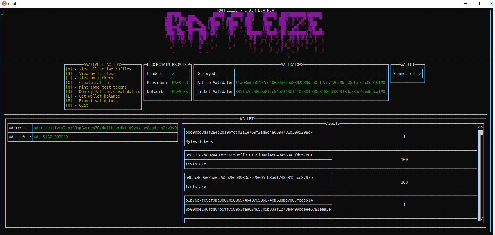

# <br> RAFFLEIZE C-A-R-D-A-N-A  
#### <br> (Commit-And-Reveal-Decentralized-Application-for-Native-Assets)
Prepared by Marius Georgescu  


- [ RAFFLEIZE C-A-R-D-A-N-A](#-raffleize-c-a-r-d-a-n-a)
      - [ (Commit-And-Reveal-Decentralized-Application-for-Native-Assets)](#-commit-and-reveal-decentralized-application-for-native-assets)
  - [🚀 Quick Start](#-quick-start)
    - [Prerequisites](#prerequisites)
    - [1. Clone and Setup](#1-clone-and-setup)
    - [2. Configure Atlas](#2-configure-atlas)
    - [3. Configure Operation Key](#3-configure-operation-key)
    - [3. Deploy validators](#3-deploy-validators)
    - [3. Build and Run](#3-build-and-run)
    - [4. Access API](#4-access-api)
  - [Overview](#overview)
    - [Key Benefits](#key-benefits)
    - [Features](#features)
  - [Architecture](#architecture)
  - [Documentation](#documentation)
  - [API Documentation](#api-documentation)
    - [Key Endpoints](#key-endpoints)
  - [Development](#development)
    - [Project Structure](#project-structure)
    - [PureScript Code Generation](#purescript-code-generation)
    - [Development Tools](#development-tools)
    - [Key Files](#key-files)
    - [Testing](#testing)
  - [Contributing](#contributing)
    - [Code Quality](#code-quality)
  - [License](#license)
  - [Support](#support)
  - [Acknowledgments](#acknowledgments)


## 🚀 Quick Start

### Prerequisites
- Unix-like operating system (Linux, macOS, or WSL2)
- Git installed
- Nix package manager
- Direnv 
***

### 1. Clone and Setup

This project uses the [The Developer Experience Shell](https://github.com/input-output-hk/devx/#the-developer-experience-shell) to build a fully-functioning and reproducible Cardano development shell for Haskell quickly and across multiple operating systems (and architectures).


```bash
git clone https://github.com/mariusgeorgescu/raffleize.git
cd raffleize
```

 * After installing and configuring `nix` and `direnv`, clone the repo and type:

```bash
 direnv allow
``` 

 * The test suite for operations (transactions) can be run with the following command:

```bash
cabal test 
```
***

### 2. Configure Atlas
Create `atlas_config.json` with your Maestro token:
```json
{
  "coreProvider": {
    "maestroToken": "YOUR_TOKEN_HERE",
    "turboSubmit": true
  },
  "networkId": "preview"
}
```
***

### 3. Configure Operation Key 
Create `operation.prv` with your private key mnemonic (24 words). Make sure you have enough funds available for covering the validators deployment. For testnet, you can get funds from the [Cardano Testnet Faucet](https://docs.cardano.org/cardano-testnets/tools/faucet).

***
### 3. Deploy validators

* This service requires validators to be deployed and to be used as reference UTxOs in the transactions.  The validators can be deployed from the TUI.

```bash
cabal run tui
```

* After deployment a file named **raffleize_validators_config.json** which contains the validators reference UTxO and the admin key.




### 3. Build and Run
```bash
# Load environment
direnv allow

# Build project
cabal run build

# Start server
cabal run server

# Or use Admin TUI
cabal run  tui
```

### 4. Access API

- API Documentation: http://localhost:8082/swagger-ui
- Default credentials: `cardano` / `lovelace`

For detailed installation instructions, see [🚀 Quick Start](#-quick-start).


## Overview

RAFFLEIZE C-A-R-D-A-N-A is a decentralized application (DApp) for digital assets raffles based on a commit and reveal scheme (CRS) as a source of randomness for electing winners. Built on the Cardano blockchain, it provides a secure, transparent, and trustless platform for conducting raffles.

### Key Benefits
- **Decentralized Trust**: Eliminates reliance on central authorities through transparent, verifiable winner selection
- **Digital Asset Monetization**: Enables asset owners to monetize their holdings through raffles
- **Enhanced Liquidity**: Tokenized raffle ownership and tickets for increased marketability
- **Privacy Preservation**: Anonymous participation fostering secure transactions
- **Inclusive Participation**: No identity verification required for participation

### Features

- **Smart Contract Integration**: Plutus-based smart contracts for secure raffle logic
- **REST API**: Full-featured API with Swagger documentation
- **Terminal User Interface**: Interactive TUI for direct interaction
- **WebSocket Support**: Real-time updates and notifications
- **Comprehensive Testing**: Unit and property-based test suite
- **PureScript Bridge**: Automated code generation for frontend integration
- **Docker Support**: Production-ready containerization

## Architecture

The project follows a modular architecture with three main components:

1. **Smart Contracts** (`src/RaffleizeDApp/OnChain/`)
   - Raffleize Validator - Main raffle logic
   - Ticket Validator - Ticket management
   - Minting Policy - NFT minting

2. **Transaction Building** (`src/RaffleizeDApp/TxBuilding/`)
   - Transaction construction and validation
   - Blockchain interactions
   - Context management

3. **User Interfaces** (`src/RaffleizeDApp/Server/`, `src/RaffleizeDApp/TUI/`)
   - REST API server
   - Terminal user interface
   - WebSocket support


## Documentation

- **[Functional Specification](Documentation/FunctionalSpecification.md)** - Detailed functional requirements and specifications
- **[Diagrams](Documentation/Diagrams/)** - Architecture and flow diagrams
- **[Changelog](CHANGELOG.md)** - Version history and changes


## API Documentation

The REST API provides endpoints for:

- **Transaction Building**: Construct and submit Cardano transactions
- **Data Lookups**: Query raffles, tickets, and user information
- **Real-time Updates**: WebSocket support for live updates
- **[API Documentation](swagger-api.json)** - Complete API reference

### Key Endpoints
- `POST /build-tx` - Build transactions
- `POST /submit-tx` - Submit transactions
- `GET /raffles` - Get all raffles
- `GET /raffle/{raffleId}` - Get specific raffle
- `POST /user-raffles` - Get user's raffles
- `POST /user-tickets` - Get user's tickets

For complete API documentation, visit the Swagger UI when the server is running.
  
## Development

### Project Structure
```
src/RaffleizeDApp/
├── OnChain/          # Smart contract code
├── TxBuilding/       # Transaction building
├── Server/           # REST API server
├── TUI/              # Terminal user interface
├── CodeGen/          # PureScript code generation
├── Tests/            # Test suite
└── CustomTypes/      # Type definitions
```


### PureScript Code Generation
```bash
just psgen
```

### Development Tools
```bash
just repl      # GHC REPL
just test      # Run tests
just gc        # Clean Nix store
just link-hls  # Link Haskell Language Server
```

### Key Files
- `raffleize.cabal` - Package configuration
- `atlas_config.json` - Atlas Cardano SDK configuration
- `raffleize_validators_config.json` - Validator addresses
- `*.plutus` - Compiled smart contracts

### Testing
```bash
cabal run test  # Run all tests
```

## Contributing

1. Follow the installation instructions
2. Set up development environment:
   ```bash
   just allow
   just link-hls  # For VS Code users
   ```
3. Start development:
   ```bash
   just repl      # For Haskell development
   just server    # For API development
   just tui       # For UI development
   ```

### Code Quality
- Follow Haskell best practices
- Ensure comprehensive test coverage
- Document all public APIs
- Prioritize type safety and correctness

## License

This project is licensed under the GPL-3.0 License - see the [LICENSE](LICENSE) file for details.

## Support

For questions and support:
- Create an issue on GitHub
- Check the [Functional Specification](Documentation/FunctionalSpecification.md) for detailed information
- Review the API documentation at the Swagger UI


## Acknowledgments
Thanks to the Cardano community for support.
This project is part of
[F10-developer-ecosystem-the-evolution - Project Catalyst Idea #105248 ](https://projectcatalyst.io/funds/10/f10-developer-ecosystem-the-evolution/development-of-a-cardano-dapp-and-extensive-documentation-of-each-step-along-the-way)